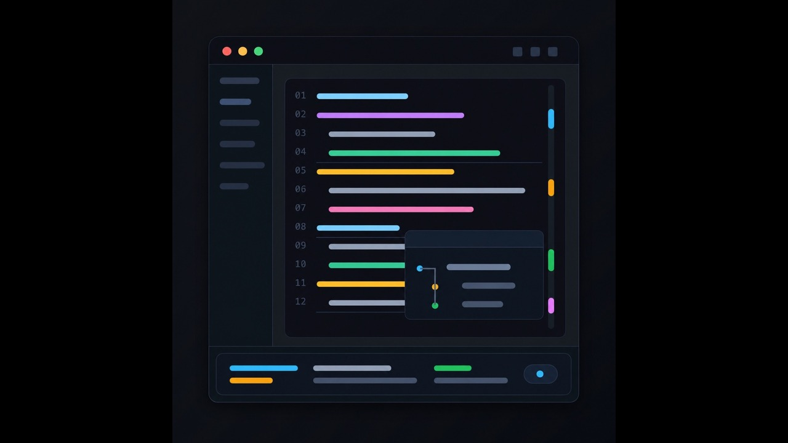

# Smart Editor

Smart Editor is a Godot editor plugin that adds small IDE-style conveniences to the built-in script editor. It focuses on fast selection, local code navigation, and lightweight refactoring helpers for GDScript.



## Features

- Smart expand/shrink selection for GDScript expressions, statements, blocks, function bodies, comments, multiline calls, arrays, dictionaries, and function signatures.
- Symbol Usage Stripe, a narrow mark strip beside the script editor scrollbar showing usages of the symbol under the caret in the current file.
- Symbol usage highlights in the visible editor area for the symbol under the caret.
- Function boundary guides that draw subtle horizontal lines between functions to make indentation-based code easier to scan.
- Extract Local Variable for selected expressions.
- Rename Symbol for the symbol under the caret.
- Inline Variable for simple local variable declarations.

## Default Shortcuts

All shortcuts can be changed in `Editor Settings` under `Plugin` -> `Smart Editor`.

- `Expand Selection`: `Meta+D` (`Command+D` on macOS)
- `Shrink Selection`: `Meta+Shift+D` (`Command+Shift+D` on macOS)
- `Extract Local Variable`: `Meta+Ctrl+V` (`Command+Control+V` on macOS)
- `Rename Symbol`: `Meta+Ctrl+R` (`Command+Control+R` on macOS)
- `Inline Variable`: `Meta+Ctrl+N` (`Command+Control+N` on macOS)

The Symbol Usage Stripe, symbol highlights, and function boundary guides do not use shortcuts. They update automatically while editing and can be configured in Editor Settings.

## Editor Settings

Settings are available in `Editor Settings` under `Plugin` -> `Smart Editor`.

- `Symbol Usage Stripe Enabled`: show or hide the right-side symbol usage stripe.
- `Symbol Usage Highlight Color`: background color for symbol usages.
- `Symbol Usage Current Highlight Color`: background color for the current usage.
- `Symbol Usage Current Outline Color`: outline color for the current usage.
- `Function Boundary Guides Enabled`: show or hide function boundary guides.
- `Function Boundary Guide Color`: color for function boundary guide lines.
- `Dialog Width`: width used by Smart Editor dialogs.
- `Debug Logs`: print extra diagnostic messages to the output.

## Installation

From the Godot Asset Library, install the addon into your project and enable `Smart Editor` in `Project` -> `Project Settings` -> `Plugins`.

For manual installation, copy this folder into your project:

```text
addons/smart-editor-plugin/
```

Then enable `Smart Editor` from the Plugins tab.

## Compatibility

Smart Editor is developed and tested with Godot `4.6.1`. Other Godot `4.6.x` releases may work, but `4.6.1` is the supported version for the first Asset Library release.

## Known Limitations

Smart Editor does not try to be a full semantic refactoring engine. Its refactorings are intentionally lightweight and editor-focused.

- `Rename Symbol` depends on Godot's code analysis service and is intended for safe current-file edits. It is not a project-wide function rename tool.
- `Extract Local Variable` and `Inline Variable` operate on recognized GDScript text patterns. They do not perform complete semantic analysis.
- Smart selection is based on a custom parser for practical editor selection ranges, not Godot's compiler AST. Some unusual syntax can still need more test cases.
- Symbol usage stripe and highlights are focused on the currently open script, not a project-wide usage view.

## License

Smart Editor is available under the MIT license. See `LICENSE` for details.
